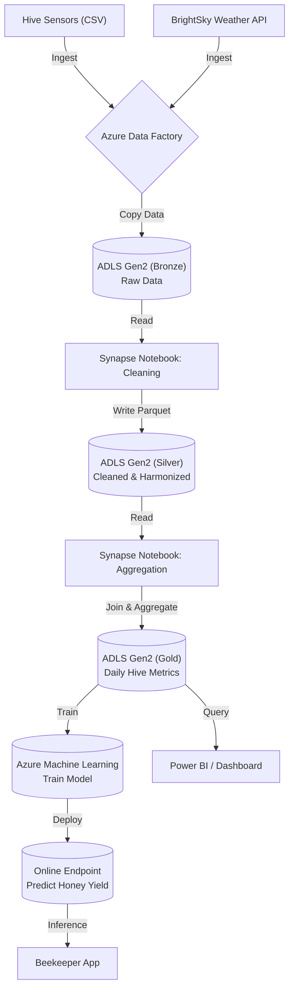

# Bee Haven: Azure Data Lakehouse for Apiculture Analytics 🐝

## Project Overview
Bee Haven is a scalable cloud data solution designed to monitor bee health and environmental factors. By integrating hive telemetry (Weight, Flow, Temperature) with external weather APIs, this system enables precision agriculture analytics to support colony survival rates.

## Architecture

The solution follows a **Medallion Architecture** pattern, orchestrated by Azure Data Factory.

1.  **Ingestion (ADF):** Azure Data Factory orchestrates data movement from on-premise CSV sensors and external APIs (BrightSky) into the Data Lake.
2.  **Storage (ADLS Gen2):**
    * **Bronze Layer:** Raw CSV and JSON data.
    * **Silver Layer:** Cleaned, deduplicated, and harmonized data stored in **Parquet** format for performance.
3.  **Transformation (Synapse):** Azure Synapse Analytics (Serverless Apache Spark/Python) handles data cleaning and schema enforcement.

## Tech Stack
* **Cloud Provider:** Microsoft Azure
* **Orchestration:** Azure Data Factory (ADF)
* **Compute:** Azure Synapse Analytics (Python Notebooks)
* **Storage:** Azure Data Lake Storage Gen2 (ADLS)
* **Language:** Python 3.10 (Pandas, Requests)
